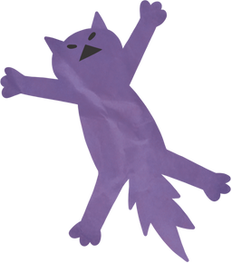

  

### Kittybot (Простой телеграмм бот)
#### Описание
Телеграмм бот показывает прикольные фотографии кошечек, которые берет с сервиса API. Если сервис временно не доступен, бот переключается на фотографии прикольных собачек.
Если оба сервиса недоступны бот выводит заглушку в виде телевизионной картинки с настройкой яркости (полоски из серых линий разной плотности заливки)

### Как это работает
Бот доступен по адресу [kittybot](https://t.me/felisa_assistant_kittybot). Для запуска бота необходимо отправить команду `/start`. Для получения изображения прикольной кошечки отправит команду `/new_cat`.

### Технологии
- python-telegram-bot 13.7
- api client

### Как запустить проект:
Клонировать репозиторий и перейти в него в командной строке:

    git clone https://github.com/26remph/kittybot.git
    cd kittybot

Cоздать и активировать виртуальное окружение:

    python -m venv env
    source env/bin/activate

Установить зависимости из файла requirements.txt:

    python -m pip install --upgrade pip
    pip install -r requirements.txt

Записать в переменные окружения (файл .env) необходимые ключи:

    токен телеграм-бота

Запустить проект:

    python kittybot.py

    
     kittybot telegram bot© 2022, created by remph ツ 

